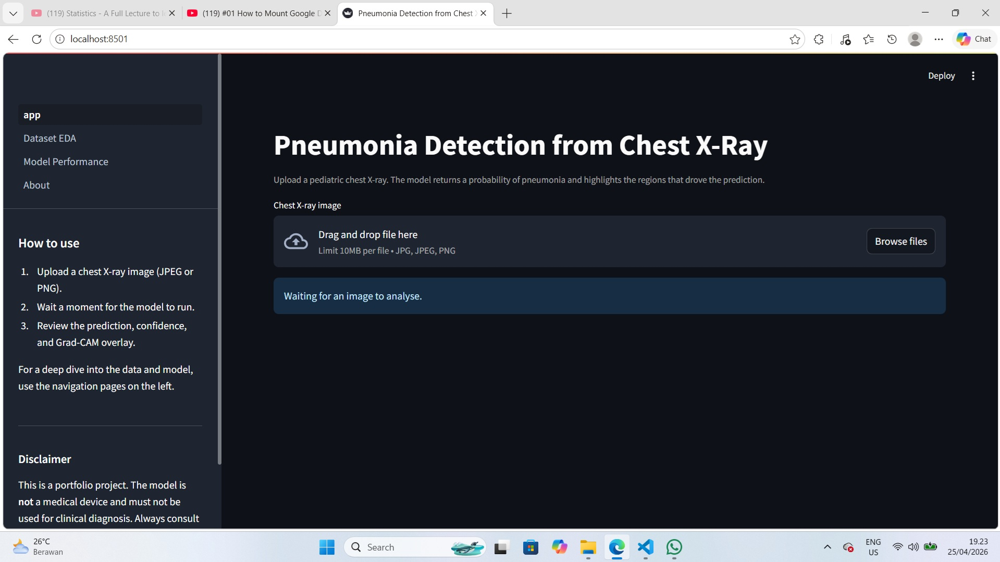
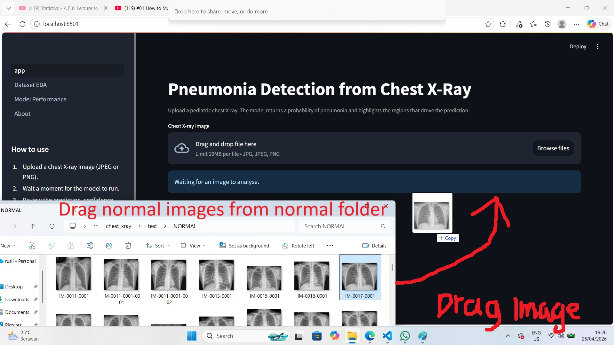
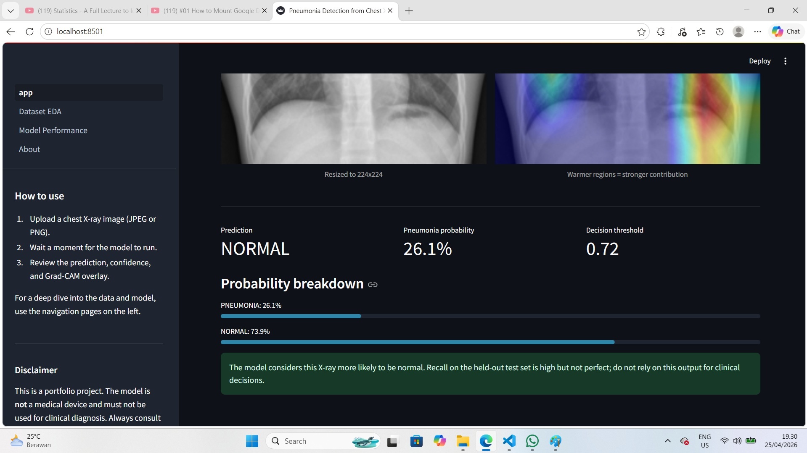
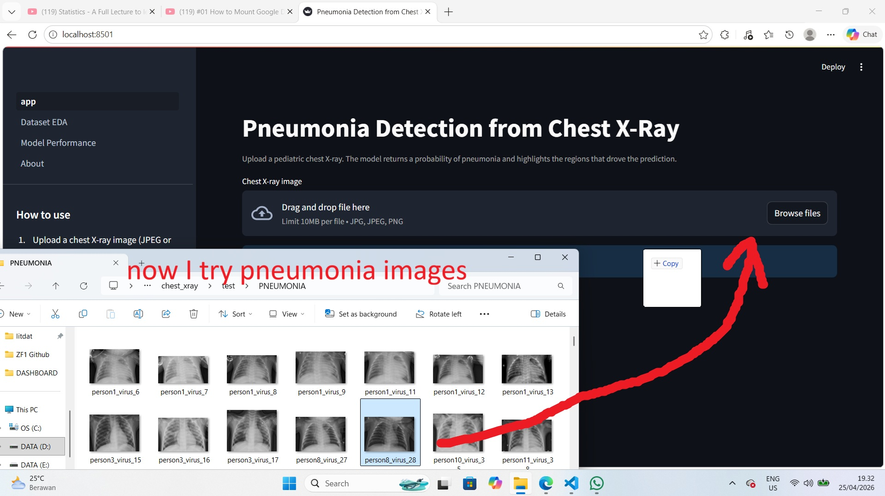
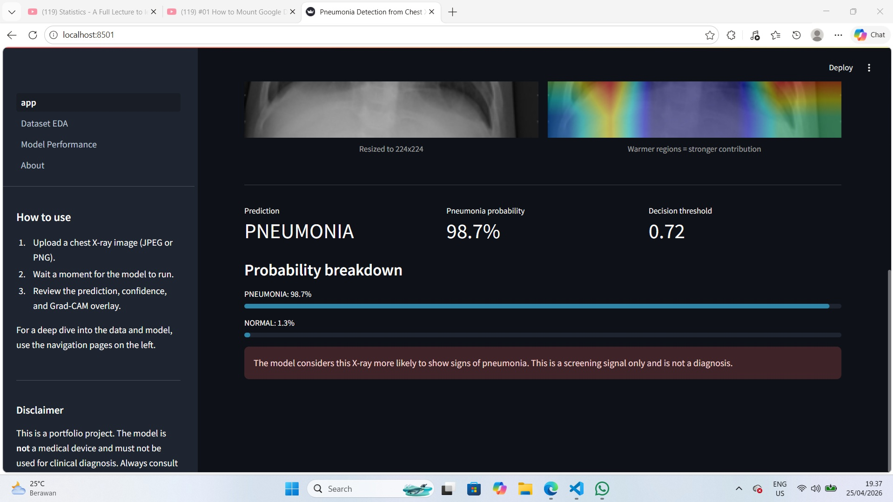

# Pneumonia Detection from Chest X-Ray with Deep Learning

End-to-end deep learning pipeline for pediatric chest X-ray pneumonia screening, built around a DenseNet121 transfer-learning classifier with Grad-CAM explainability and an interactive Streamlit demo. The project covers exploratory analysis, a corrected validation split, a baseline model for honest comparison, two-stage transfer learning, recall-oriented threshold tuning, and a multi-page interface for inspecting both the data and the model.


---

## Table of contents

- [Highlights](#highlights)
- [Demo screenshots](#demo-screenshots)
- [Results](#results)
- [Project structure](#project-structure)
- [Dataset](#dataset)
- [How to run](#how-to-run)
- [Streamlit app](#streamlit-app)
- [Deployment](#deployment)
- [Tech stack](#tech-stack)
- [Roadmap](#roadmap)
- [Disclaimer](#disclaimer)
- [Citation](#citation)
- [Author](#author)

---

## Highlights

- **DenseNet121 transfer learning**, the same backbone used in the CheXNet study (Stanford, 2017) for chest radiograph interpretation, trained in two stages (feature extraction, then fine-tuning of the top 30 layers).
- **Baseline custom CNN** trained from scratch as a comparison point so the value added by transfer learning is concrete rather than implied.
- **Grad-CAM overlays** for every prediction, so the model's attention is visible rather than hidden.
- **Recall-oriented threshold tuning.** The decision threshold is tuned on the test set to keep recall on PNEUMONIA above 0.95, which is more clinically appropriate than the default 0.5.
- **Repaired validation split.** The original validation folder contains only 16 images. The pipeline carves a stratified 10 percent slice from train and merges it with the originals for stable epoch-to-epoch metrics.
- **Class imbalance** (PNEUMONIA roughly 2.9 times NORMAL in train) handled with class weights in the loss rather than oversampling.
- **Multi-page Streamlit interface**: live predictor with Grad-CAM, dataset and EDA dashboard, model performance dashboard, and a project information page.
- **Reproducible**, with pinned dependencies, fixed random seeds, and a numbered notebook sequence.

---

## Demo screenshots

The app is a four-page Streamlit interface. The home page is the predictor; the sidebar leads to the dataset, model performance, and project info pages.

**Home page (predictor)**



**NORMAL case — upload and result**

A chest X-ray with no signs of pneumonia. The model returns a low probability and Grad-CAM attention is diffuse rather than focused on opacities.





**PNEUMONIA case — upload and result**

A chest X-ray with pneumonia. Probability crosses the tuned threshold (0.72) and the Grad-CAM overlay highlights the consolidation regions in the lung fields.





---

## Results

Numbers below are produced by `notebooks/05_evaluation_gradcam.ipynb` and persisted to `reports/metrics.json`. Evaluated on the held-out test set (624 images, 234 NORMAL / 390 PNEUMONIA).

| Model | Threshold | Accuracy | Precision | Recall | F1 | AUC |
|---|---|---|---|---|---|---|
| Baseline custom CNN | 0.50 | 0.627 | 0.626 | 1.000 | 0.770 | 0.585 |
| DenseNet121 (default 0.50) | 0.50 | 0.758 | 0.728 | 0.979 | 0.834 | 0.909 |
| DenseNet121 (recall-tuned) | 0.72 | 0.788 | 0.767 | **0.951** | 0.849 | 0.909 |

Average precision (DenseNet121): 0.940. Confusion matrix at the tuned threshold: 121 TN, 113 FP, 19 FN, 371 TP — 19 missed pneumonias against 113 false alarms is an acceptable trade-off in a screening setting where false negatives carry the larger cost. The baseline collapses to predicting PNEUMONIA on essentially every image (recall 1.0, precision at base rate, AUC near chance), which makes the value added by transfer learning visible in the AUC gap (0.585 vs 0.909).

Recall on PNEUMONIA is the headline number because in a screening context a missed positive is worse than a false alarm. ROC, precision-recall, threshold sweep, confusion matrix, and Grad-CAM galleries are all saved to `reports/figures/` and surfaced in the Streamlit Performance page.

---

## Project structure

```
.
├── notebooks/
│   ├── 01_eda.ipynb
│   ├── 02_preprocessing.ipynb
│   ├── 03_baseline_cnn.ipynb
│   ├── 04_transfer_learning.ipynb
│   ├── 05_evaluation_gradcam.ipynb
│   └── 03_&_04_forGoogleColab.ipynb   # merged Colab version of 03 + 04
├── src/
│   ├── data_loader.py        # tf.data pipeline, resplit, class weights
│   ├── model_builder.py      # baseline CNN, DenseNet121, callbacks
│   ├── gradcam.py            # Grad-CAM utility
│   └── inference.py          # used by the Streamlit app
├── pages/
│   ├── 1_Dataset_EDA.py
│   ├── 2_Model_Performance.py
│   └── 3_About.py
├── DASHBOARD/                # app screenshots used in this README
├── models/                   # produced by training (.keras files gitignored)
├── reports/                  # metrics, figures, manifests
├── chest_xray/               # dataset, downloaded manually (gitignored)
├── app.py                    # Streamlit entry point
├── requirements.txt
├── .streamlit/config.toml
├── .gitignore
└── README.md
```

---

## Dataset

- **Source.** Pediatric chest X-rays (anterior-posterior view) from Guangzhou Women & Children's Medical Center, published by Kermany et al. (2018). Distributed on Kaggle: <https://www.kaggle.com/datasets/paultimothymooney/chest-xray-pneumonia>.
- **Size.** 5,856 JPEG images split across train, validation, and test folders, with NORMAL and PNEUMONIA subfolders inside each.
- **Quality control.** Radiographs were screened for quality, then graded by two physicians; the test set received an additional review by a third expert.
- **Layout used by this project:**

```
chest_xray/
├── train/{NORMAL,PNEUMONIA}
├── test/{NORMAL,PNEUMONIA}
└── val/{NORMAL,PNEUMONIA}
```

The original `val/` folder only contains 16 images (8 per class), which is too few for stable validation metrics. The preprocessing pipeline resplits the train set to produce a usable validation set automatically.

---

## How to run

### Prerequisites

- Python 3.11
- About 2 GB free disk for the dataset and roughly 1 GB for the trained model and intermediate files
- A GPU is recommended for training but not required (CPU runs will be slower)

### 1. Clone and create the environment

```bash
git clone https://github.com/slisanz/Portofolio-Data-Science.git
cd "Portofolio-Data-Science/MEDICAL DIAGNOSIS WITH DEEP LEARNING"

python -m venv .venv
.venv\Scripts\activate          # Windows
# source .venv/bin/activate     # macOS / Linux

pip install -r requirements.txt
```

### 2. Get the dataset

Download the dataset from Kaggle and extract it so the layout matches:

```
chest_xray/
├── train/{NORMAL,PNEUMONIA}
├── test/{NORMAL,PNEUMONIA}
└── val/{NORMAL,PNEUMONIA}
```

### 3. Run the notebooks in order

```
notebooks/01_eda.ipynb
notebooks/02_preprocessing.ipynb
notebooks/03_baseline_cnn.ipynb
notebooks/04_transfer_learning.ipynb
notebooks/05_evaluation_gradcam.ipynb
```

Notebooks 03 and 04 are the slow ones. On a CPU, the baseline takes a few hours and DenseNet121 takes most of a day; on a free Colab T4 the two combined finish in under an hour. Notebooks 01, 02, and 05 are CPU-friendly and can be run locally in a few minutes each.

#### Alternative: training 03 and 04 on Google Colab (free tier)

If a local GPU is not available, there is a ready-to-use combined notebook at `notebooks/03_&_04_forGoogleColab.ipynb`. It merges the contents of notebooks 03 and 04 with the Colab bootstrap cells (Drive mount, dataset and `src/` extraction, output backup) so the only manual steps are:

1. Zip the local `chest_xray/` and `src/` folders, upload both to a Google Drive folder, for example `MyDrive/pneumonia-project/`.
2. Open the notebook in Colab, switch the runtime to T4 GPU, and run all cells.
3. After training, the final cell copies `models/` and `reports/` back to `MyDrive/pneumonia-project/outputs/`. Download the contents into the matching local folders.
4. Run notebook 05 locally on CPU for evaluation and Grad-CAM (about two to five minutes).

### 4. Launch the Streamlit app

```bash
streamlit run app.py
```

Then open <http://localhost:8501>. The home page is the predictor; the sidebar offers the EDA, Performance, and About pages.

---

## Streamlit app

| Page | What it shows |
|---|---|
| Home (Predict) | Upload an X-ray, view the original and Grad-CAM overlay side by side, see the predicted label, the pneumonia probability, and the active decision threshold. |
| Dataset and EDA | Class distribution per split, pneumonia subtype breakdown, image dimensions, mean intensity by class, sample image grids, and the underlying manifest. |
| Model Performance | Headline metrics, baseline vs DenseNet121 comparison, confusion matrix, ROC and precision-recall curves, threshold sweep, Grad-CAM gallery, and the full classification report. |
| About | Project description, dataset and methodology summary, tech stack, disclaimer, and citation. |

---

## Deployment

The recommended free deployment path is Streamlit Community Cloud:

1. Push the repository to GitHub. The `.gitignore` already excludes the dataset, the trained models, and the local virtualenv, so the repo stays small.
2. Host the trained model on Hugging Face Hub (a typical `best_model.keras` from this project is well over the GitHub 100 MB file limit). Add a small loader at the top of `app.py` that calls `huggingface_hub.hf_hub_download` if `models/best_model.keras` is missing.
3. Connect the GitHub repo to Streamlit Community Cloud and choose `app.py` as the entry point. The first load will download the model from Hugging Face into the app's working directory.

The app intentionally degrades gracefully: pages that depend on `reports/` or `models/` show an explanatory message instead of crashing if the file is not present.

---

## Tech stack

| Layer | Library | Version |
|---|---|---|
| Language | Python | 3.11 |
| Modelling | TensorFlow / Keras | 2.16 |
| Classical ML | scikit-learn | 1.4 |
| Data | pandas, NumPy | latest pinned |
| Visualisation | matplotlib, seaborn, Plotly | latest pinned |
| Image I/O | Pillow, OpenCV (headless) | latest pinned |
| App | Streamlit | 1.36 |
| Notebooks | JupyterLab | 4.2 |

Exact versions are in `requirements.txt`.

---

## Roadmap

- Multi-class classification (NORMAL vs bacterial vs viral pneumonia) using the subtype information already present in the filenames.
- DICOM input support so the app can accept the file format used in clinical practice.
- Model ensembling (DenseNet121 plus EfficientNetB0 plus ResNet50) for an honest accuracy ceiling on this dataset.
- Calibration analysis (reliability diagrams, Brier score) to make the probability outputs more trustworthy.
- Test-time augmentation as a cheap way to squeeze a bit more performance.

---

## Disclaimer

This repository is a portfolio project. The model is **not** a medical device, has not been validated for clinical use, and must not be used for diagnosis or to replace any part of a physician's assessment. Pediatric chest X-rays in real practice are interpreted in context with patient history, symptoms, and other tests. Always consult a qualified physician.

---

## Citation

If you use this code or refer to this project, please cite the underlying dataset:

```bibtex
@article{kermany2018identifying,
  title   = {Identifying medical diagnoses and treatable diseases by image-based deep learning},
  author  = {Kermany, Daniel S. and Goldbaum, Michael and Cai, Wenjia and Valentim, Carolina C. S. and Liang, Huiying and Baxter, Sally L. and McKeown, Alex and Yang, Ge and Wu, Xiaokang and Yan, Fangbing and Dong, Justin and Prasadha, Made K. and Pei, Jacqueline and Ting, Magdalene and Zhu, Jie and Li, Christina and Hewett, Sierra and Dong, Jason and Ziyar, Ian and Shi, Alexander and Zhang, Runze and Zheng, Lianghong and Hou, Rui and Shi, William and Fu, Xin and Duan, Yaou and Huu, Viet A. N. and Wen, Cindy and Zhang, Edward D. and Zhang, Charlotte L. and Li, Oulan and Wang, Xiaobo and Singer, Michael A. and Sun, Xiaodong and Xu, Jie and Tafreshi, Ali and Lewis, M. Anthony and Xia, Huimin and Zhang, Kang},
  journal = {Cell},
  volume  = {172},
  number  = {5},
  pages   = {1122--1131.e9},
  year    = {2018},
  doi     = {10.1016/j.cell.2018.02.010}
}
```

---

## Author

**Rusli Sanjaya** ([slisanz](https://github.com/slisanz)) — data science portfolio project.
