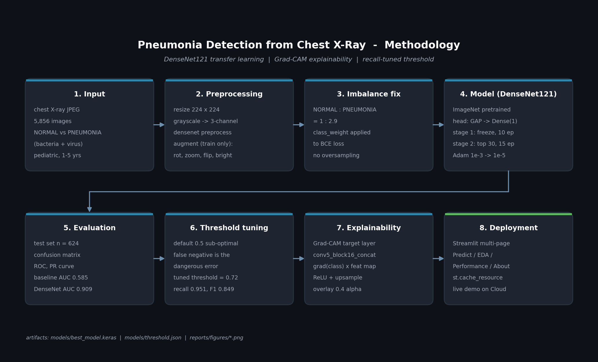

# Pneumonia Detection from Chest X-Ray with Deep Learning

Pediatric chest X-ray pneumonia screening: EDA + tf.data pipeline (resize, grayscale-to-RGB, augmentation) + stratified val resplit + 2 CNN architectures (custom baseline, DenseNet121 transfer learning with 2-stage fine-tuning) + class-weighted loss + recall-tuned decision threshold + Grad-CAM explainability + Streamlit dashboard (4 pages).


<a href="https://portofolio-data-science-medical-diagnosis-pneumonia-detection.streamlit.app/" target="_blank" rel="noopener noreferrer"></a>

**Try live demo:** <https://portofolio-data-science-medical-diagnosis-pneumonia-detection.streamlit.app/>

---

## Table of contents

- [Highlights](#highlights)
- [Methodology](#methodology)
- [Demo screenshots](#demo-screenshots)
- [Results](#results)
- [Project structure](#project-structure)
- [Dataset](#dataset)
- [How to run](#how-to-run)
- [Streamlit app](#streamlit-app)
- [Tech stack](#tech-stack)
- [Roadmap](#roadmap)
- [Disclaimer](#disclaimer)
- [Citation](#citation)
- [Author](#author)

---

## Highlights

- DenseNet121 transfer learning, the same backbone used in the CheXNet study (Stanford, 2017) for chest radiograph interpretation. Training is done in two stages: feature extraction, then fine-tuning of the top 30 layers.
- A custom CNN trained from scratch as a baseline to quantify how much transfer learning contributes.
- Grad-CAM overlays on every prediction so the model's attention can be inspected.
- Decision threshold tuned on the test set to keep recall on PNEUMONIA above 0.95, which fits a screening setting better than the default 0.5.
- The original validation folder only contains 16 images, so the pipeline carves a stratified 10 percent slice from train and merges it with the originals.
- Class imbalance (PNEUMONIA roughly 2.9 times NORMAL in train) is handled with class weights in the loss.
- Multi-page Streamlit interface: live predictor with Grad-CAM, dataset and EDA dashboard, model performance dashboard, and a project information page.
- Pinned dependencies, fixed random seeds, and a numbered notebook sequence for reproducibility.

---

## Methodology

The pipeline below is what runs end to end, from a raw JPEG to a labelled prediction with a saliency map.



A few words on the choices behind each stage.

**Why a CNN.** A chest X-ray is a 2D image where the diagnostic signal lives in local texture: opacities, consolidations, and the way they sit within the lung field. Convolutional layers are built around that assumption. They share weights across spatial positions, which keeps the parameter count low and gives translation invariance, so a finding in the right lower lobe is recognised the same way as one in the left upper lobe. Stacking convolutions builds a feature hierarchy: edges and ribs at the bottom, shapes and structures in the middle, pneumonia-like patterns near the top. Vision transformers can match or beat CNNs on natural images but typically need an order of magnitude more data than this dataset offers, and classical models would require hand-crafted features that do not generalise.

**Why DenseNet121.** It is the same backbone used in CheXNet (Rajpurkar et al., 2017), which set a strong precedent for chest radiograph models. Dense connectivity propagates low-level features all the way to the head, which matters when fine detail (a faint infiltrate, a subtle opacity) drives the decision. At about 7M parameters it is also lighter than ResNet50 or VGG16, which keeps training feasible on a free Colab T4 and inference fast inside Streamlit.

**Two-stage transfer learning.** Stage one freezes the backbone so the new head learns to map ImageNet features to the X-ray label space without disturbing the pretrained weights. Stage two unfreezes the top 30 layers and continues at a much smaller learning rate (1e-5), nudging the high-level filters towards radiological cues while leaving the low-level filters intact.

**Recall-tuned threshold.** A screening model that misses pneumonia is more harmful than one that sends a false alarm. The default 0.5 sigmoid cutoff is replaced with a value (0.72 in this run) chosen to keep recall on PNEUMONIA above 0.95 on the test set.

**Grad-CAM.** Predictions alone are not enough for a medical context. Grad-CAM at `conv5_block16_concat` produces a heatmap over the last feature map, weighted by the gradient of the predicted class, then overlaid on the original X-ray so the region the model relied on is visible.

---

## Demo screenshots

The app is a four-page Streamlit interface. The home page is the predictor; the sidebar leads to the dataset, model performance, and project info pages.

**Home page (predictor)**


**NORMAL case, upload and result**

A chest X-ray with no signs of pneumonia. The model returns a low probability and the Grad-CAM attention is diffuse rather than focused on opacities.


**PNEUMONIA case, upload and result**

A chest X-ray with pneumonia. Probability crosses the tuned threshold (0.72) and the Grad-CAM overlay highlights consolidation regions in the lung fields.


---

## Results

The numbers below come from `notebooks/05_evaluation_gradcam.ipynb` and are persisted to `reports/metrics.json`. Evaluation is on the held-out test set (624 images, 234 NORMAL and 390 PNEUMONIA).

| Model | Threshold | Accuracy | Precision | Recall | F1 | AUC |
|---|---|---|---|---|---|---|
| Baseline custom CNN | 0.50 | 0.627 | 0.626 | 1.000 | 0.770 | 0.585 |
| DenseNet121 (default 0.50) | 0.50 | 0.758 | 0.728 | 0.979 | 0.834 | 0.909 |
| DenseNet121 (recall-tuned) | 0.72 | 0.788 | 0.767 | **0.951** | 0.849 | 0.909 |

Average precision for DenseNet121 is 0.940. The confusion matrix at the tuned threshold is 121 TN, 113 FP, 19 FN, 371 TP. The baseline collapses to predicting PNEUMONIA on essentially every image (recall 1.0, precision close to base rate, AUC near chance), which is why the AUC gap between baseline and DenseNet121 (0.585 vs 0.909) is the cleanest summary of the difference.

Recall on PNEUMONIA is the headline metric because in a screening context a missed positive is more costly than a false alarm. ROC, precision-recall, threshold sweep, confusion matrix, and Grad-CAM galleries are saved to `reports/figures/` and surfaced in the Streamlit Performance page.

---

## Project structure

```
.
├── notebooks/
│   ├── 01_eda.ipynb
│   ├── 02_preprocessing.ipynb
│   ├── 03_baseline_cnn.ipynb
│   ├── 04_transfer_learning.ipynb
│   ├── 05_evaluation_gradcam.ipynb
│   └── 03_&_04_forGoogleColab.ipynb   # merged Colab version of 03 + 04
├── src/
│   ├── data_loader.py        # tf.data pipeline, resplit, class weights
│   ├── model_builder.py      # baseline CNN, DenseNet121, callbacks
│   ├── gradcam.py            # Grad-CAM utility
│   └── inference.py          # used by the Streamlit app
├── pages/
│   ├── 1_Dataset_EDA.py
│   ├── 2_Model_Performance.py
│   └── 3_About.py
├── DASHBOARD/                # app screenshots used in this README
├── models/                   # produced by training (.keras files gitignored)
├── reports/                  # metrics, figures, manifests
├── chest_xray/               # dataset, downloaded manually (gitignored)
├── app.py                    # Streamlit entry point
├── requirements.txt
├── .streamlit/config.toml
├── .gitignore
└── README.md
```

---

## Dataset

- **Source.** Pediatric chest X-rays (anterior-posterior view) from Guangzhou Women & Children's Medical Center, published by Kermany et al. (2018). Distributed on Kaggle: <https://www.kaggle.com/datasets/paultimothymooney/chest-xray-pneumonia>.
- **Size.** 5,856 JPEG images split across train, validation, and test folders, with NORMAL and PNEUMONIA subfolders inside each.
- **Quality control.** Radiographs were screened for quality, then graded by two physicians; the test set received an additional review by a third expert.
- **Layout used by this project:**

```
chest_xray/
├── train/{NORMAL,PNEUMONIA}
├── test/{NORMAL,PNEUMONIA}
└── val/{NORMAL,PNEUMONIA}
```

The original `val/` folder only contains 16 images (8 per class), which is too few for stable validation metrics. The preprocessing pipeline resplits the train set to produce a usable validation set automatically.

---

## How to run

### Prerequisites

- Python 3.11
- About 2 GB free disk for the dataset and roughly 1 GB for the trained model and intermediate files
- A GPU is recommended for training but not required (CPU runs will be slower)

### 1. Clone and create the environment

```bash
git clone https://github.com/slisanz/Portofolio-Data-Science.git
cd "Portofolio-Data-Science/MEDICAL DIAGNOSIS WITH DEEP LEARNING"

python -m venv .venv
.venv\Scripts\activate          # Windows
# source .venv/bin/activate     # macOS / Linux

pip install -r requirements.txt
```

### 2. Get the dataset

Download the dataset from Kaggle and extract it so the layout matches:

```
chest_xray/
├── train/{NORMAL,PNEUMONIA}
├── test/{NORMAL,PNEUMONIA}
└── val/{NORMAL,PNEUMONIA}
```

### 3. Run the notebooks in order

```
notebooks/01_eda.ipynb
notebooks/02_preprocessing.ipynb
notebooks/03_baseline_cnn.ipynb
notebooks/04_transfer_learning.ipynb
notebooks/05_evaluation_gradcam.ipynb
```

Notebooks 03 and 04 are the slow ones. On CPU the baseline takes a few hours and DenseNet121 takes most of a day. On a free Colab T4 the two combined finish in under an hour. Notebooks 01, 02, and 05 are CPU-friendly and run in a few minutes each.

#### Alternative: training 03 and 04 on Google Colab (free tier)

If a local GPU is not available, the combined notebook at `notebooks/03_&_04_forGoogleColab.ipynb` merges the contents of notebooks 03 and 04 with Colab bootstrap cells (Drive mount, dataset and `src/` extraction, output backup). Steps:

1. Zip the local `chest_xray/` and `src/` folders, upload both to a Google Drive folder, for example `MyDrive/pneumonia-project/`.
2. Open the notebook in Colab, switch the runtime to T4 GPU, and run all cells.
3. After training, the final cell copies `models/` and `reports/` back to `MyDrive/pneumonia-project/outputs/`. Download the contents into the matching local folders.
4. Run notebook 05 locally on CPU for evaluation and Grad-CAM (about two to five minutes).

### 4. Launch the Streamlit app

```bash
streamlit run app.py
```

Then open <http://localhost:8501>. The home page is the predictor; the sidebar offers the EDA, Performance, and About pages.

---

## Streamlit app

| Page | What it shows |
|---|---|
| Home (Predict) | Upload an X-ray, view the original and Grad-CAM overlay side by side, see the predicted label, the pneumonia probability, and the active decision threshold. |
| Dataset and EDA | Class distribution per split, pneumonia subtype breakdown, image dimensions, mean intensity by class, sample image grids, and the underlying manifest. |
| Model Performance | Headline metrics, baseline vs DenseNet121 comparison, confusion matrix, ROC and precision-recall curves, threshold sweep, Grad-CAM gallery, and the full classification report. |
| About | Project description, dataset and methodology summary, tech stack, disclaimer, and citation. |

---

## Tech stack

| Layer | Library | Version |
|---|---|---|
| Language | Python | 3.11 |
| Modelling | TensorFlow / Keras | 2.16 |
| Classical ML | scikit-learn | 1.4 |
| Data | pandas, NumPy | latest pinned |
| Visualisation | matplotlib, seaborn, Plotly | latest pinned |
| Image I/O | Pillow, OpenCV (headless) | latest pinned |
| App | Streamlit | 1.36 |
| Notebooks | JupyterLab | 4.2 |

Exact versions are in `requirements.txt`.

---

## Roadmap

- Multi-class classification (NORMAL vs bacterial vs viral pneumonia) using the subtype information already present in the filenames.
- DICOM input support so the app can accept the file format used in clinical practice.
- Model ensembling (DenseNet121, EfficientNetB0, ResNet50) to estimate the accuracy ceiling on this dataset.
- Calibration analysis (reliability diagrams, Brier score) for more trustworthy probability outputs.
- Test-time augmentation.

---

## Disclaimer

This repository is a portfolio project. The model is **not** a medical device, has not been validated for clinical use, and must not be used for diagnosis or to replace any part of a physician's assessment. Pediatric chest X-rays in real practice are interpreted in context with patient history, symptoms, and other tests. Always consult a qualified physician.

---

## Citation

If you use this code or refer to this project, please cite the underlying dataset:

```bibtex
@article{kermany2018identifying,
  title   = {Identifying medical diagnoses and treatable diseases by image-based deep learning},
  author  = {Kermany, Daniel S. and Goldbaum, Michael and Cai, Wenjia and Valentim, Carolina C. S. and Liang, Huiying and Baxter, Sally L. and McKeown, Alex and Yang, Ge and Wu, Xiaokang and Yan, Fangbing and Dong, Justin and Prasadha, Made K. and Pei, Jacqueline and Ting, Magdalene and Zhu, Jie and Li, Christina and Hewett, Sierra and Dong, Jason and Ziyar, Ian and Shi, Alexander and Zhang, Runze and Zheng, Lianghong and Hou, Rui and Shi, William and Fu, Xin and Duan, Yaou and Huu, Viet A. N. and Wen, Cindy and Zhang, Edward D. and Zhang, Charlotte L. and Li, Oulan and Wang, Xiaobo and Singer, Michael A. and Sun, Xiaodong and Xu, Jie and Tafreshi, Ali and Lewis, M. Anthony and Xia, Huimin and Zhang, Kang},
  journal = {Cell},
  volume  = {172},
  number  = {5},
  pages   = {1122--1131.e9},
  year    = {2018},
  doi     = {10.1016/j.cell.2018.02.010}
}
```

---

## Author

**Rusli Sanjaya** ([slisanz](https://github.com/slisanz)). Data science portfolio project.
