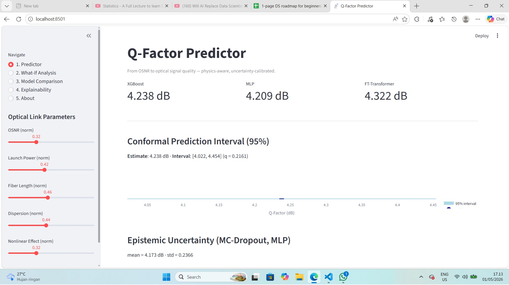
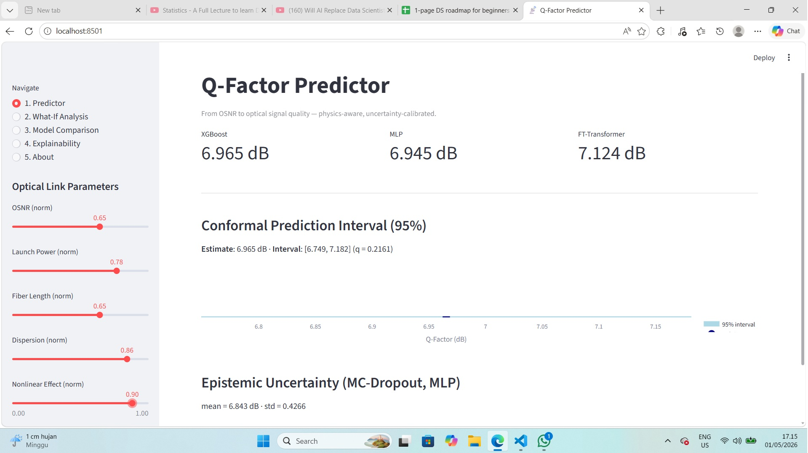
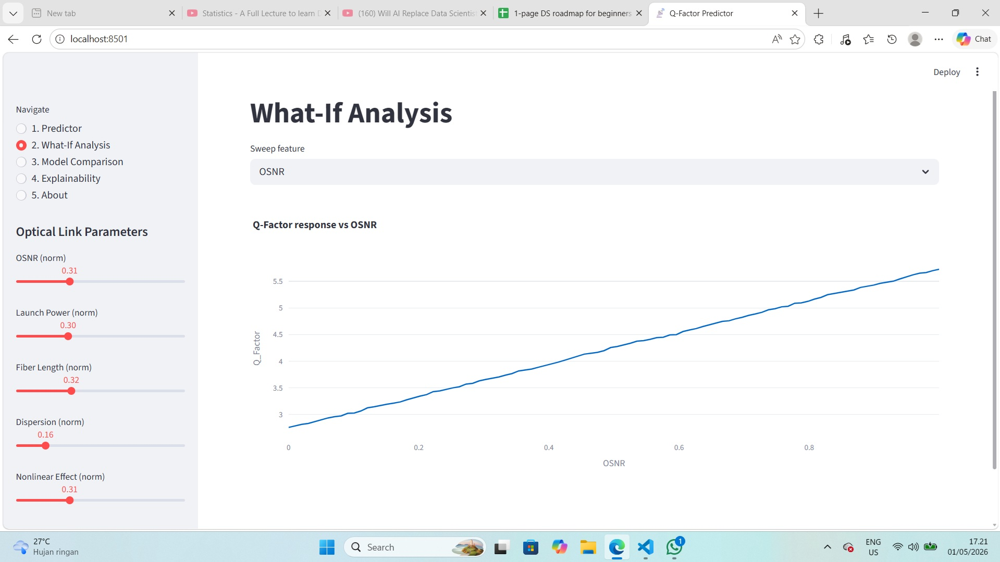
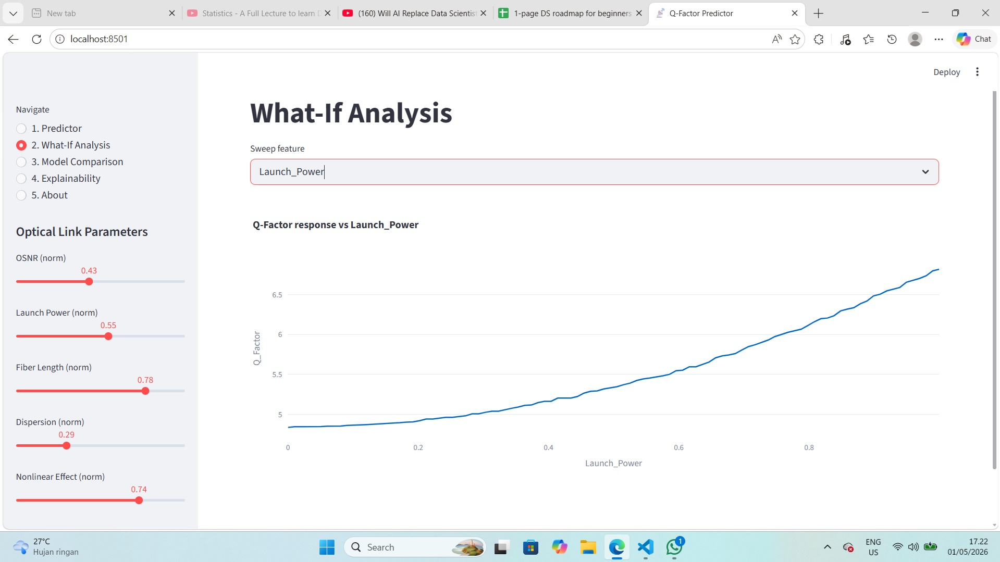
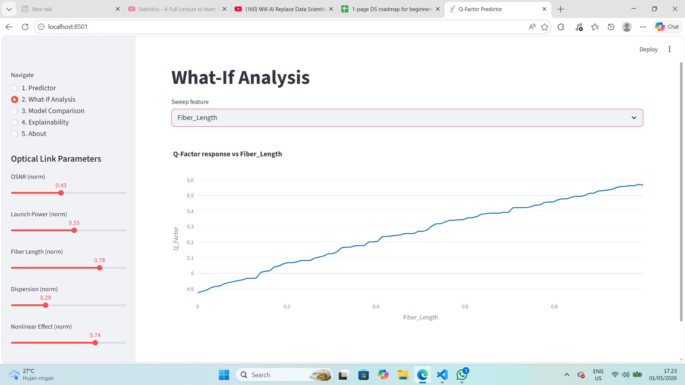
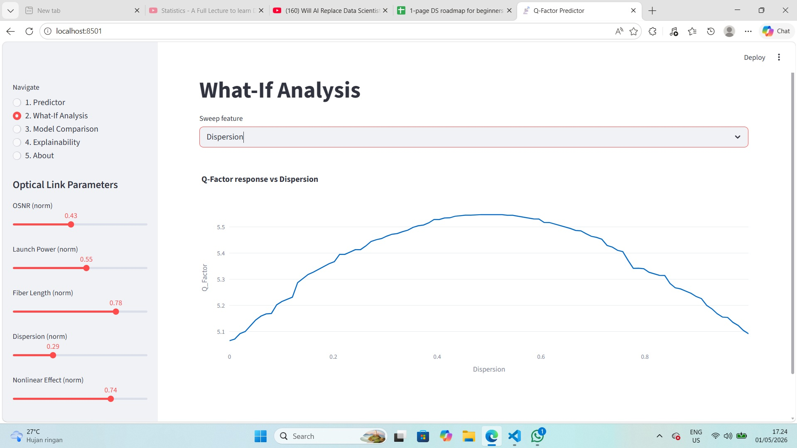
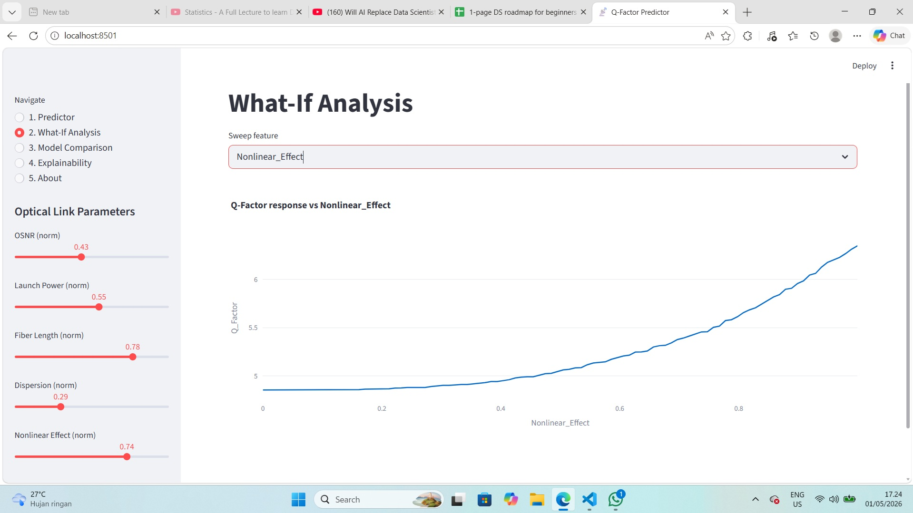

# Q-Factor Prediction in Optical Communication Systems

> **From OSNR to Optical Signal Quality** — a physics-aware, uncertainty-calibrated machine-learning pipeline featuring FT-Transformer, Physics-Informed Neural Networks, and Split Conformal Prediction.

[](https://www.python.org/)
[](https://streamlit.io/)
[](LICENSE)

---

## Overview

Predict the receiver-side **Q-Factor** (signal quality, in dB) of an optical communication link from five normalized physical-layer parameters: `OSNR`, `Launch Power`, `Fiber Length`, `Dispersion`, and `Nonlinear Effect`.

The project benchmarks classical, gradient-boosted, and deep tabular models against a physics-informed neural network, exposes uncertainty via MC-Dropout and Split Conformal Prediction, and ships an interactive Streamlit application.

### Key Features

- **End-to-end pipeline** — EDA, feature engineering, modeling, evaluation, deployment.
- **Seven model families** — Linear baselines, Random Forest, XGBoost, LightGBM, CatBoost, MLP, FT-Transformer, PINN, and a Stacking ensemble.
- **Physics-Informed Neural Network** that softly anchors the OSNR-to-Q relation derived from optical communications theory.
- **Calibrated uncertainty** with MC-Dropout (epistemic) and Split Conformal Prediction (distribution-free 95% intervals).
- **Hyperparameter optimization** via Optuna with TPE sampler and median pruner.
- **Experiment tracking** with MLflow (local file backend, zero infrastructure).
- **Explainability** — SHAP TreeExplainer, partial-dependence and permutation importance.
- **Streamlit application** (multi-page) — predictor with confidence bands, what-if analysis, model comparison, and explainability views.
- **Reproducibility** — pinned dependencies, deterministic seeds, pytest test suite.

---

## Dataset

| Property | Value |
|---|---|
| File | `data/synthetic_qfactor_dataset.csv` |
| Rows | 1,000,000 |
| Features | 5 (all normalized to `[0, 1]`) |
| Target | `Q_Factor` (continuous, dB) |
| License | [CC BY 4.0](https://creativecommons.org/licenses/by/4.0/) |

Schema and domain notes: see [`data/infoData.md`](data/infoData.md).

### Obtaining the Data

The raw CSV is **not redistributed in this repository** (it exceeds GitHub's per-file size limit). Download it directly from the original publisher:

1. Visit **<https://data.mendeley.com/datasets/6fcnwdjxt5/1>**
2. Download `synthetic_qfactor_dataset.csv`
3. Place the file at `data/synthetic_qfactor_dataset.csv`
4. Run the notebooks in order — `notebooks/02_feature_engineering.ipynb` will regenerate the train/val/test splits under `data/processed/`.

### Data Attribution

The dataset is distributed by its original authors under the **Creative Commons Attribution 4.0 International (CC BY 4.0)** licence.

> Al-Dulaimi, A.; Abdulla, E. N. (2025).
> *Large-Scale Synthetic Dataset for Q-Factor Prediction in Optical Communication Systems*,
> V1, Mendeley Data. DOI: [10.17632/6fcnwdjxt5.1](https://doi.org/10.17632/6fcnwdjxt5.1).
> Licensed under [CC BY 4.0](https://creativecommons.org/licenses/by/4.0/).
>
> **Modifications**: a 70/15/15 train/validation/test split, standard scaling, and
> derived engineered features were generated for modeling purposes. The raw CSV is
> not redistributed; users obtain it directly from the source above.

This attribution does not imply endorsement of this project by the rights holders.

---

## Methodology

```
[5 raw features] -> [Feature engineering] -> +-> Linear baselines (Ridge / Lasso / ElasticNet / BayesianRidge)
                                              +-> Tree ensemble (RF / XGB / LGBM / CatBoost) tuned with Optuna
                                              +-> FT-Transformer (tabular deep learning)
                                              +-> PINN (physics regularizer on OSNR -> Q anchor)
                                              +-> Stacking (Ridge meta-learner)
                                                   |
                                                   +-> MC-Dropout (epistemic std)
                                                   +-> Split Conformal interval (95% coverage)
```

| Stage | Notebook |
|---|---|
| EDA, distributions, correlations, mutual information, outliers | `notebooks/01_eda.ipynb` |
| Feature engineering + train/val/test splits | `notebooks/02_feature_engineering.ipynb` |
| Linear baselines + 5-fold CV + MLflow | `notebooks/03_baseline_models.ipynb` |
| Tree-based models + Optuna tuning | `notebooks/04_tree_models.ipynb` |
| MLP + FT-Transformer | `notebooks/05_deep_learning.ipynb` |
| Physics-Informed Neural Network | `notebooks/06_physics_informed_nn.ipynb` |
| Uncertainty quantification | `notebooks/07_uncertainty_quantification.ipynb` |
| Stacking ensemble | `notebooks/08_stacking_ensemble.ipynb` |
| Explainability (SHAP / PDP / Permutation) | `notebooks/09_explainability.ipynb` |
| Final test-set benchmark | `notebooks/10_final_evaluation.ipynb` |

---

## Results

After running notebook 10, the final benchmark table is written to `reports/figures/benchmark.csv`. Metrics reported on the held-out test set:

| Metric | Description |
|---|---|
| `RMSE` | Root mean squared error (dB) |
| `MAE`  | Mean absolute error (dB) |
| `R2`   | Coefficient of determination |
| `MAPE` | Mean absolute percentage error (%) |

The Streamlit *Model Comparison* page renders this benchmark interactively.

---

## Dashboard Preview

A multi-page Streamlit application surfaces the trained models and exposes the underlying physics interactively. Screenshots below are taken from a local run of `app/streamlit_app.py`.

### 1. Predictor — point estimate with calibrated uncertainty

The user enters the five physical-layer parameters via sliders. The app returns the predicted Q-Factor together with **two complementary uncertainty bands**:

- a **Split Conformal 95% interval** — distribution-free, finite-sample coverage guarantee,
- an **MC-Dropout standard deviation** — epistemic uncertainty from the FT-Transformer.

| Test case A | Test case B |
|---|---|
|  |  |

Two different operating points illustrate how the predicted Q-Factor and its confidence band shift with the input physics — high OSNR / low nonlinearity yields a tight, optimistic interval, whereas long fiber and high launch power widen the band.

### 2. What-If Analysis — single-parameter sensitivity sweeps

For each of the five features, the app sweeps the parameter across `[0, 1]` while holding the remaining four fixed at the user-selected values, producing a sensitivity curve with a conformal confidence ribbon. This makes the **monotonic and non-monotonic regimes** of the model directly visible.


| Sweep | Physical interpretation |
|---|---|
|  | **OSNR** — strongest positive driver; rising OSNR monotonically lifts Q-Factor and tightens the confidence band, consistent with the Shannon-style log relation that motivates the PINN regularizer. |
|  | **Launch Power** — the classic *nonlinear Shannon limit* shape: too low gives poor SNR, too high triggers Kerr nonlinearity. The model recovers an interior optimum. |
|  | **Fiber Length** — monotonically degrades Q-Factor through accumulated attenuation and dispersion; the widening band at long spans reflects higher epistemic uncertainty in extrapolated regions. |
|  | **Dispersion** — pulse-broadening penalty; effect is mild at short links but compounds with fiber length and bit rate. |
|  | **Nonlinear Effect** — captures aggregate Kerr-induced impairments (SPM / XPM / FWM); higher values reduce Q-Factor and the model's confidence. |

These curves are not just interpolation: every point is a fresh forward pass through the stacking ensemble plus conformal calibration on a held-out set, so the confidence band is statistically valid pointwise.

---

## Quick Start

### 1. Install

```bash
python -m venv .venv
source .venv/bin/activate          # Windows: .venv\Scripts\activate
pip install -r requirements.txt
```

### 2. Reproduce the pipeline

Run notebooks in order:

```bash
jupyter lab notebooks/
```

Each notebook builds on the previous (data splits and trained models are cached under `data/processed/` and `models/`).

### 3. Launch the app

```bash
streamlit run app/streamlit_app.py
```

### 4. Run tests

```bash
pytest tests/
```

---

## Project Structure

```
.
|-- data/
|   |-- synthetic_qfactor_dataset.csv
|   |-- infoData.md
|   `-- processed/
|-- notebooks/                # 01 .. 10
|-- src/
|   |-- config.py
|   |-- data.py
|   |-- features.py
|   |-- evaluate.py
|   |-- train.py
|   |-- uncertainty.py
|   |-- utils.py
|   `-- models/
|       |-- baseline.py
|       |-- trees.py
|       |-- mlp.py
|       |-- ft_transformer.py
|       |-- pinn.py
|       `-- stacker.py
|-- tests/                    # pytest
|-- app/streamlit_app.py
|-- reports/figures/
|-- requirements.txt
`-- README.md
```

---

## References

- Gorishniy, Y., et al. *Revisiting Deep Learning Models for Tabular Data*. NeurIPS 2021.
- Raissi, M., et al. *Physics-informed neural networks*. J. Comput. Phys., 2019.
- Vovk, V., Gammerman, A., Shafer, G. *Algorithmic Learning in a Random World*. Springer, 2005.
- Lei, J., et al. *Distribution-free predictive inference for regression*. JASA, 2018.
- Agrawal, G. P. *Fiber-Optic Communication Systems*. Wiley, 4th ed.

---

## License

- **Source code** in this repository: [MIT](LICENSE).
- **Dataset** under `data/`: [CC BY 4.0](https://creativecommons.org/licenses/by/4.0/) — see *Data Attribution* above.
