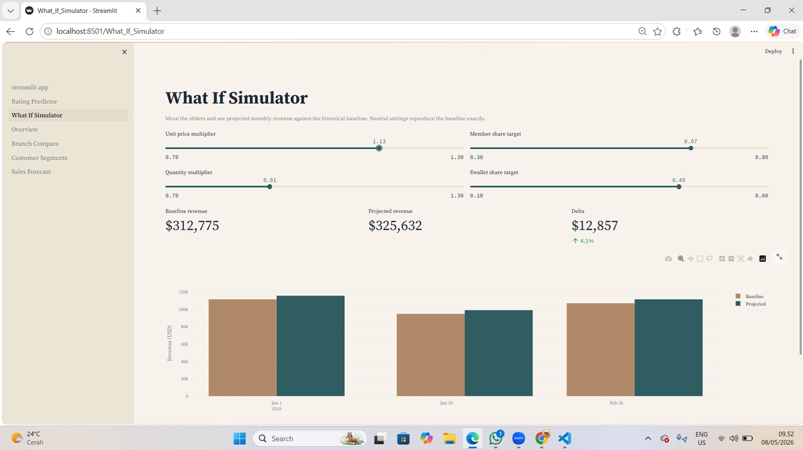
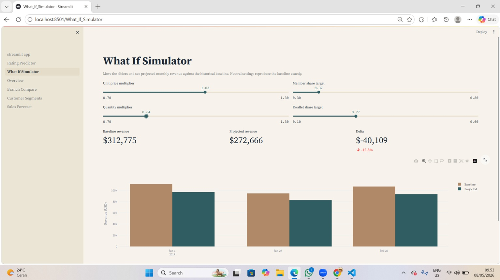

# Retail Analytics And Forecasting Platform

> Documented data cleaning policy with empirical impact study + data engineering (pandas plus parquet) + RFM customer segmentation (KMeans with silhouette based k selection) + dual time series forecasting (Prophet vs ARIMA with walk forward CV per branch) + rating regression (Ridge baseline plus Gradient Boosting champion) + SHAP explainability + market basket mining (Apriori with lift ranked rules) + statistical testing (one way ANOVA across branches) + Streamlit dashboard (six pages including interactive what if simulator).

Multi branch retail analytics on a 1000 transaction supermarket dataset spanning three branches in Myanmar (Yangon, Mandalay, Naypyitaw). The repository covers exploratory analysis, feature engineering, customer segmentation, sales forecasting, rating prediction, and market basket analysis, and ships an interactive Streamlit dashboard with a what if simulator.

## Stack

Python 3.11, pandas, scikit learn, Prophet, statsmodels, mlxtend, SHAP, Plotly, Streamlit.

## Repository Layout

```
data/
  raw/supermarket_sales.csv
  processed/                 parquet artifacts produced by notebooks
notebooks/
  00_data_cleaning.ipynb
  01_eda.ipynb
  02_feature_engineering.ipynb
  03_customer_segmentation.ipynb
  04_sales_forecasting.ipynb
  05_rating_prediction.ipynb
  06_market_basket.ipynb
src/                          shared library used by notebooks and app
app/                          Streamlit dashboard (multi page)
models/                       joblib model artifacts
reports/figures/              exported charts
DASHBOARD/                    screenshots of the running dashboard
```

## Dashboard Preview

The `DASHBOARD/` folder holds screenshots taken from the running Streamlit app. They give a quick visual reference for the two flagship interactive pages without having to launch the app first.

| File | Page | What it shows |
|------|------|---------------|
| `DASHBOARD/Rating Predictor1.jpg` | Rating Predictor | Input form for transaction features and the predicted customer rating returned by the Gradient Boosting model. |
| `DASHBOARD/Rating Predictor2.jpg` | Rating Predictor | SHAP local contribution chart explaining which features pushed the prediction up or down. |
| `DASHBOARD/wis1.jpg` | What If Simulator | Sliders for unit price, quantity, payment mix, and member share, with the projected monthly revenue. |
| `DASHBOARD/wis2.jpg` | What If Simulator | Delta view comparing the simulated scenario against the baseline gross income. |





## Concepts Coverage

| Area | Technique | Where |
|------|-----------|-------|
| Data quality | per column cleaning policy (drop vs mode vs median), recompute of derived monetary columns, empirical comparison of three cleaning strategies on downstream model MAE | `notebooks/00_data_cleaning.ipynb`, `src/data_loader.py` |
| Data engineering | pandas wrangling, parquet artifacts, modular `src/` library | `src/data_loader.py`, `src/features.py` |
| EDA | distributions, group-bys, statistical summaries, visual storytelling, all on the already cleaned table | `notebooks/01_eda.ipynb` |
| Feature engineering | datetime parsing, cyclical/temporal features, basket tiers, one-hot encoding | `notebooks/02_feature_engineering.ipynb` |
| Unsupervised learning | RFM proxy at invoice level, log transform, standard scaling, KMeans with silhouette based k selection | `notebooks/03_customer_segmentation.ipynb` |
| Time series | per branch daily aggregation, walk forward cross validation, Prophet vs ARIMA model selection by MAE, 30 day forecast with confidence band | `notebooks/04_sales_forecasting.ipynb` |
| Supervised regression | Ridge baseline + Gradient Boosting champion, MAE/RMSE on hold out split, fixed seed for reproducibility | `notebooks/05_rating_prediction.ipynb` |
| Explainability | SHAP global beeswarm + local contributions surfaced in the app | `notebooks/05_rating_prediction.ipynb`, `app/pages/1_Rating_Predictor.py` |
| Association rules | basket aggregation, Apriori with adaptive support threshold, lift ranked rules | `notebooks/06_market_basket.ipynb` |
| Statistical testing | one-way ANOVA across branches | `app/pages/4_Branch_Compare.py` |
| Productisation | Streamlit multi page dashboard, cached parquet and joblib loaders, what if simulator | `app/` |
| Reproducibility | pinned `requirements.txt`, fixed `RANDOM_SEED = 42`, deterministic notebook order | `requirements.txt`, `src/config.py` |

## Methodology

1. **Data cleaning** audits missing values column by column, applies a documented per column policy (drop the analysis pivot, impute the safe ones with mode or median, recompute derived monetary columns), verifies zero NaN, and quantifies the impact of the policy by training the same model on three differently cleaned versions of the data. The output `transactions_clean.parquet` is the single source of truth for every downstream notebook.
2. EDA loads the already cleaned table and establishes the schema, distributions, and headline metrics. No cleaning happens in this notebook.
3. Feature engineering derives temporal, customer, and basket features and writes the canonical transactions table.
4. Customer segmentation builds an invoice level RFM proxy and fits KMeans with silhouette based k selection.
5. Sales forecasting compares Prophet and ARIMA on per branch daily revenue using walk forward cross validation, then emits a 30 day forecast.
6. Rating prediction trains Ridge and Gradient Boosting baselines, scores on a held out split, and explains predictions with SHAP.
7. Market basket analysis aggregates daily product line co occurrence per branch and surfaces top lift rules with Apriori.

## Data Cleaning Policy

The raw extract has 1003 invoices, with missing values concentrated in five columns. A blanket `dropna()` would discard around 14 percent of all invoices and bias revenue downward, so cleaning is column by column.

| Column | Missing | Action | Rationale |
|--------|---------|--------|-----------|
| `Product line` | 43 | Drop the row | Analysis pivot for product mix, segmentation, and basket rules. Imputing it would invent a category that does not exist in the business. |
| `Customer type` | 79 | Impute with mode | Two valid values only; mode preserves class balance and keeps the row available for revenue and rating analysis. |
| `Unit price` | 7 | Impute with median | Median is robust to skew. Affected rows are less than 1 percent. |
| `Quantity` | 20 | Impute with median | Same reasoning as `Unit price`. |
| `Date` | 0 | Parse `%m/%d/%y` | Two digit year format. Unparseable rows would be dropped (none observed). |

After imputation, the derived monetary columns (`Total`, `cogs`, `Tax 5%`, `gross income`) are recomputed from `Unit price` x `Quantity` so each row remains internally consistent. Result: **960 clean transactions**, zero NaN, $312,775 total revenue. The policy is implemented in `src/data_loader.basic_clean` and applied in `notebooks/00_data_cleaning.ipynb`.

### Where each notebook reads its data

Only one notebook touches the raw CSV. Every model in this project is trained on the cleaned data, never on the raw extract.

| Notebook | Input it reads | Purpose |
|----------|----------------|---------|
| `00_data_cleaning.ipynb` | `data/raw/supermarket_sales.csv` | The only consumer of the raw file. Audits NaN, applies the policy, writes `transactions_clean.parquet`. |
| `01_eda.ipynb` | `transactions_clean.parquet` | Descriptive analysis on the cleaned table. No training. |
| `02_feature_engineering.ipynb` | `transactions_clean.parquet` | Adds 11 derived features, writes `transactions.parquet`. |
| `03_customer_segmentation.ipynb` | `transactions.parquet` | KMeans fit on RFM features. |
| `04_sales_forecasting.ipynb` | `transactions.parquet` | Prophet and ARIMA fit per branch. |
| `05_rating_prediction.ipynb` | `transactions.parquet` | Ridge and Gradient Boosting fit on transaction context. |
| `06_market_basket.ipynb` | `transactions.parquet` | Apriori on aggregated branch day baskets. |

### Empirical impact

The same rating prediction model is trained on three differently cleaned versions of the data. Lower MAE is better.

| Strategy | Rows kept | Ridge MAE | GBR MAE |
|----------|-----------|-----------|---------|
| A. Drop any row that contains any NaN | 865 | 1.4657 | 1.5256 |
| **B. The policy adopted here** | **960** | **1.4150** | **1.4377** |
| C. Blind impute every NaN, including `Product line` | 1003 | 1.5178 | 1.5684 |

Strategy A throws away too much data; the model trains on a smaller frame and MAE rises. Strategy C keeps every row but invents `Product line` categories that did not exist in the business; the extra rows are noise and MAE is the worst of the three. Strategy B wins because it matches the meaning of each column.

## Key Findings

1. Branch C leads on both revenue and gross income.
2. Fashion accessories is the revenue leader, while Food and beverages is the rating leader.
3. Members contribute the larger revenue share and have a higher average basket than non members.
4. Cash and Ewallet are nearly tied on revenue, room to migrate volume into digital rails.
5. January is the strongest month and a clear target for stocking and promotion planning.

## How to Run Locally

```
python -m venv .venv
.venv\Scripts\Activate.ps1            # Windows PowerShell
pip install -r requirements.txt

jupyter notebook                       # run notebooks 00 to 06 in order
streamlit run app/streamlit_app.py     # launch the dashboard, opens in browser
```

Run the notebooks in numeric order, top to bottom, so each one can read the parquet artifact produced by the previous step. The first run of `04_sales_forecasting.ipynb` takes the longest (Prophet fits per branch, two to five minutes).

## Dataset

Public Kaggle dataset: Supermarket Sales (1003 raw transactions, 17 columns). After the cleaning policy described above, **960 transactions** are retained for analysis. The raw file is held under `data/raw/supermarket_sales.csv`; the cleaned table is produced by `notebooks/00_data_cleaning.ipynb` and persisted to `data/processed/transactions_clean.parquet`.

