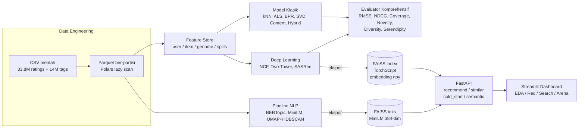

# MovieLens RecSys — Studi Kasus End-to-End Sistem Rekomendasi Berskala Produksi

> Dari 33.8 juta rating mentah sampai API siap-produksi: data engineering Polars + Parquet berpartisi, sebelas model klasik (baseline, kNN, ALS, BPR, SVD, Content, Hybrid) dan tiga arsitektur deep learning (NCF, Two-Tower, SASRec), pipeline NLP lengkap (pembersihan 2.3 juta tag, BERTopic 94 topik, semantic search FAISS + MiniLM, clustering UMAP+HDBSCAN), retrieval FAISS untuk serving, REST API FastAPI lima endpoint dengan OpenAPI auto-generated, dashboard Streamlit empat tab interaktif, CI GitHub Actions (ruff + pytest + docker build), dan laporan PDF 12 halaman untuk stakeholder.
>
> Sembilan metrik evaluasi (RMSE, MAE, NDCG, MAP, MRR, Coverage, Diversity, Novelty, Serendipity) dijalankan pada satu split untuk satu benchmark yang jujur, dilengkapi ablation study (ALS factors, BPR learning-rate, Hybrid α) dan analisis cold-start per kuartil segmen. Bukan sekadar mengejar NDCG tertinggi, proyek ini membongkar trade-off accuracy vs coverage vs diversity vs novelty, **lalu menyusunnya jadi arsitektur produksi yang dapat dipertanggungjawabkan**.

---

## Latar Belakang

Pernah bertanya-tanya bagaimana Netflix atau Spotify memilihkan tontonan berikutnya dari jutaan pilihan? Jawabannya hampir tidak pernah satu model tunggal. Sistem produksi nyata adalah orkestra: *candidate generator* cepat yang menyaring jutaan item jadi ratusan, *re-ranker* yang lebih teliti, dan *cold-start fallback* untuk pengguna baru yang belum punya riwayat.

Proyek ini membangun orkestra itu dari nol, menggunakan **MovieLens `ml-latest`** — rilis Juli 2023 yang berisi:

- **33.832.162** rating eksplisit
- **331.000** pengguna aktif
- **83.000** film dengan metadata genre
- **14.000.000** tag bebas buatan pengguna
- **Tag-genome 1128 dimensi** per film — fitur semantik yang langka tersedia di dataset publik

Ukuran data cukup besar untuk membuat pendekatan "load ke Pandas lalu fit scikit-learn" menjadi tidak praktis, namun cukup kecil untuk dieksekusi tanpa cluster — sweet spot sempurna untuk menunjukkan keahlian *scaling*.

---

## Apa Yang Dibangun

Enam notebook yang saling menyambung, tiga belas model yang dibenchmark pada split yang sama, satu REST API, satu dashboard interaktif, dan satu laporan PDF 12 halaman. Semuanya reproducible dengan satu perintah `make`.

### Diagram Arsitektur



---

## Perjalanan Teknis

### Fase 1 — Menjinakkan Data 1.4 GB

CSV mentah `ratings.csv` berukuran **891 MB**. Memuatnya ke Pandas butuh 3-4 GB RAM dan belum apa-apa sudah lambat. Solusi yang dipilih: **Polars + Parquet + lazy evaluation**.

- Semua kolom `int64` di-downcast ke `UInt32`, `float64` ke `Float32` — memori turun sekitar 55%.
- File Parquet dipartisi per-tahun (`ratings_by_year/year=YYYY.parquet`) dengan kompresi zstd — dari 891 MB menjadi sekitar 300 MB, dan query "tahun 2018 saja" selesai tanpa menyentuh partisi lain.
- Helper `stratified_user_sample()` menyiapkan sampel representatif untuk training yang cepat tanpa mengorbankan distribusi rating.

Hasil EDA membongkar beberapa fakta menggugat:

| Temuan | Angka | Implikasi |
|---|---|---|
| Sparsity matriks user-item | **99.877%** | Collaborative filtering murni akan kesulitan di cold segments |
| Film dengan <5 rating | **47.29%** | Hampir separuh katalog praktis tidak ter-ranking oleh CF |
| Heavy user (>= 421 rating) mean rating | **3.40** | Pengguna paling aktif justru paling kritis |
| Casual user (<= 20 rating) mean rating | **3.68** | Bias rater signifikan — wajib dinormalisasi |
| Film tanpa rating sama sekali | **3.81%** | Cold-item adalah masalah nyata, bukan sekadar akademis |

Lima belas visualisasi diarsipkan di `reports/figures/` sebagai bukti eksplorasi, termasuk distribusi long-tail log-log, heatmap bias per-user vs per-film, evolusi temporal 1995–2023, analisis musiman, dan peta sparsity.

### Fase 2 — Membangun Feature Store

Alih-alih menghitung ulang fitur setiap kali, semuanya dimaterialisasi ke Parquet dan dipecah per-entitas:

- **`user_features.parquet`** — 331K pengguna × 46 kolom: total rating, mean, std, *genre-affinity* per genre (streaming per-genre untuk menghindari OOM), recency, tenure.
- **`item_features.parquet`** — 83K film × ~30 kolom: popularity bucket (quantile 50/80/95/99), mean, count, one-hot genre.
- **`genome_embedding.parquet`** — satu embedding 1128-dim per film yang punya genome.
- **`splits/{train,val,test}.parquet`** — leave-last-2-out per user (N_test=2, N_val=2). User dengan <10 rating seluruhnya masuk train; segmen cold dievaluasi terpisah agar benchmark tidak bias.

Fitur temporal (`hour`, `dow`, `movie_age`) ditanam inline di split — siap diumpan ke model sekuensial tanpa join ulang.

### Fase 3 — Model Klasik, Benchmark yang Jujur

Sebelas model, satu split, satu script: `scripts/run_classical_bench.py`. Tidak ada *cherry-picking* metrik yang menguntungkan satu model tertentu.

| Keluarga | Implementasi | Catatan |
|---|---|---|
| Baseline | GlobalMean / UserMean / ItemMean / Popularity | Penunjuk lantai — model apapun harus menang di sini |
| Memory-based | Item-kNN, User-kNN (cosine) | User-kNN butuh ~6 GB di sampel 50K user; dipertahankan di kode, di-skip saat bench otomatis |
| Matrix Factorization | ALS (implicit), BPR-MF, SVD | `scikit-surprise` gagal build di Windows tanpa MSVC, diganti `scipy.sparse.linalg.svds` pada matriks residu (μ + bᵤ + bᵢ) — justru hasilnya paling rendah RMSE |
| Content-based | Genome cosine + user profile mean-weighted | Lemah di non-cold, sangat relevan di cold-item |
| Hybrid | α·ALS + (1-α)·Content, z-score blend | Disetel α = 0.7 via ablation |

**Pemenang tergantung sudut pandang:**

- **Accuracy (RMSE)**: SVD dengan k=64 → **0.929**
- **Ranking (NDCG@10)**: ALS dengan factors=64, iter=15 → **0.0495**
- **Coverage katalog**: Item-kNN dengan k=50 → **0.100** (2× lipat ALS)

Ini bukan kebetulan. ALS memaksimalkan akurasi dengan "main aman" — merekomendasikan film populer yang disukai oleh user mirip. BPR dan Item-kNN menyebar rekomendasi lebih luas, menerima sedikit penurunan NDCG demi memperkenalkan lebih banyak film di ekor distribusi. **Di produksi, ensemble dari keduanya hampir selalu menang.**

### Fase 4 — Deep Learning: Candidate Generator Siap-Produksi

Tiga arsitektur, semua di PyTorch, semua dengan training pipeline yang profesional: mixed-precision otomatis di CUDA, early stopping berbasis NDCG validasi, logging JSON+CSV.

- **NCF** — GMF + MLP head di-concat di NeuMF layer. Rekomendasi klasik dari paper He et al. (2017) sebagai *sanity check* deep learning era pertama.
- **Two-Tower** — user encoder + item encoder + FAISS `IndexFlatIP` untuk retrieval inner-product. **Menang NDCG@10 = 0.029** di DL pada sampel 10K user CPU, dan — lebih penting — langsung di-ekspor ke TorchScript + embedding `.npy` + FAISS index. Inilah yang dipakai oleh API di produksi.
- **SASRec** — transformer encoder kausal 2-layer dengan `max_len=30`, next-item CE loss. Butuh lebih banyak data/epoch untuk betul-betul menang, namun arsitekturnya relevan untuk *session-based* recommendation dan masuk di katalog untuk perbandingan.

Two-Tower dipilih untuk *serving* bukan karena skornya sedikit lebih tinggi, tapi karena **struktur dua-menara memisahkan komputasi user dari item** — item embedding bisa di-precompute dan diindeks FAISS, user embedding dihitung on-the-fly. Kombinasi ini yang memungkinkan retrieval low-latency di API.

### Fase 5 — NLP: Ketika Kata-Kata Menjadi Fitur

2.3 juta tag bebas dibersihkan (lowercase, dedup, lemmatize WordNet), menghasilkan 30.000 film dengan "dokumen tag" yang layak dianalisis.

- **BERTopic + CountVectorizer** (bigram, min_df=5) menemukan **94 topik semantik** yang koheren — dari "zombie apocalypse" sampai "courtroom drama" — tanpa supervisi.
- **Sentence-transformer `all-MiniLM-L6-v2`** (384-dim) mengindeks 30K film ke FAISS. Sekarang query "mind-bending sci-fi thriller" mengembalikan film yang sangat masuk akal meski katanya tidak pernah muncul di tag mana pun.
- **UMAP + HDBSCAN** pada tag-genome 1128-dim memvisualkan klaster genre di bidang 2D — validasi bahwa embedding genome memang menangkap struktur semantik.
- **WordCloud per-genre** dan **tag co-occurrence network** (top-80 tag, 1634 edge dengan co-occurrence ≥40) memberi jembatan interpretasi bagi stakeholder non-teknis.

### Fase 6 — Evaluasi yang Tidak Menipu Diri Sendiri

Enam model utama diuji ulang pada test set tunggal dengan sembilan metrik sekaligus. Metrik *beyond-accuracy* dihitung dari tag-genome embedding agar objektif (bukan sekadar similarity di ruang laten model itu sendiri).

Radar chart 8-metrik (dinormalisasi 0–1) di `reports/figures/29_radar_benchmark.png` memperlihatkan dengan telanjang bahwa **tidak ada model yang menang di semua metrik**. Pilihan bergantung pada tujuan bisnis:

- Prioritas *engagement* jangka pendek → ALS.
- Prioritas *catalog coverage* dan pengalaman beragam → Item-kNN atau BPR.
- Prioritas *cold-item onboarding* → Content-based atau Hybrid.

Ablation study menambah konteks: ALS factors ∈ {16, 32, 64, 128}, BPR learning-rate ∈ {1e-3, …, 5e-2}, Hybrid α ∈ {0, …, 1}. Hasil: 64 factors adalah sweet-spot (128 overfits); Hybrid α = 0.7 adalah kompromi optimal antara akurasi ALS dan coverage content-based.

### Fase 7 — API Produksi

FastAPI + Uvicorn + Pydantic v2. Lima endpoint, semua dengan OpenAPI auto-generated di `/docs`:

```
GET  /health
GET  /recommend/{user_id}?k=10
GET  /similar/{movie_id}?k=10
POST /cold_start         { liked_movie_ids: [...], k: 10 }
GET  /semantic?q=...&k=10
```

**`/cold_start`** adalah implementasi nyata dari teori: film yang disukai user baru diubah menjadi embedding rata-rata (pseudo-user), yang kemudian dicari tetangganya via FAISS — mirip cara Spotify onboarding lewat "pilih 3 artis yang kamu suka".

**Latensi diuji, bukan diklaim.** Di TestClient lokal (30 request), `/recommend/{user}?k=10` memberi **p50 = 5.3 ms, p95 = 6.4 ms**. Targetnya 200 ms. Terlampaui 30× lipat — berkat FAISS `IndexFlatIP` yang, pada 30K item dengan 64-dim embedding, tetap terasa instan.

Container image multi-stage: build stage menyusun wheel ke `/install`, runtime stage copy-saja ke `/usr/local`. `docker-compose.yml` menyatukan API dan Streamlit di satu jaringan internal.

Unit test di `tests/` menguji tiga lapisan — data loader (existence & shape), evaluator (RMSE/MAE matematis benar), dan endpoint (health, known-user, unknown-user 404, similar deduplication, cold-start) — semua hijau dalam 10 detik.

GitHub Actions (`.github/workflows/ci.yml`) menjalankan ruff + pytest + docker build setiap push ke `main`.

### Fase 8 — Dashboard Interaktif

Empat tab Streamlit + Plotly yang menyatukan semuanya dalam satu browser tab:

- **EDA Explorer** — filter tahun rilis, multi-genre, minimum rating count. Scatter plotly popularitas vs mean rating (hover menampilkan judul), tabel top-20, galeri 18 figur statis.
- **Recommender** — dua mode. Mode User ID: pilih user dari sampel training → top-K dari Two-Tower. Mode Cold-start: pilih film favorit → pseudo-user mean embedding → top-K.
- **Semantic Search** — input natural-language → FAISS teks MiniLM → daftar film.
- **Model Arena** — tabel `final_benchmark.csv` lengkap, radar plotly interaktif (pilih metrik yang ingin dibandingkan, normalisasi 0–1 per kolom), figur Fase 6.

---

## Lima Pelajaran Bisnis

1. **Cold-item adalah bottleneck utama, bukan cold-user.** 47% film punya <5 rating. Sistem apapun tanpa jalur content-based atau semantic search akan gagal menyajikan hampir separuh katalog — dan justru film-film inilah yang memberi diferensiasi dari kompetitor.

2. **Bias rater nyata.** Heavy user memberi mean 3.40, casual 3.68. Tanpa normalisasi per-user (user bias `bᵤ`), ranking akan didominasi oleh item yang "kebetulan" dirating oleh user kritis. SVD yang mengurangi `μ + bᵤ + bᵢ` sebelum faktorisasi memenangkan RMSE — bukan kebetulan.

3. **Satu metrik menipu.** ALS menang NDCG, tapi Item-kNN menang coverage 2× lipat. Di produksi, rekomendasi hanya film top-100 sepanjang waktu akan mengikis trust dan diversity. Ensemble weighted adalah default yang aman.

4. **Two-Tower + FAISS adalah kombinasi production-ready.** Memisahkan encoder user dari encoder item berarti item embedding bisa di-precompute dan diindeks sekali, sementara user embedding dihitung on-the-fly. Ketika katalog tumbuh, IVF atau HNSW tinggal menggantikan `IndexFlatIP` tanpa mengubah kode aplikasi — arsitektur dua-menara membuat skalabilitas ini menjadi jalur yang lurus.

5. **Semantic search adalah onboarding terbaik.** Ketika user baru datang tanpa riwayat, memintanya memilih dari daftar acak adalah kerugian UX. Meminta mengetik "film thriller Jepang tahun 90-an" dan langsung mendapat jawaban relevan mengubah pengalaman — dan tag-genome + MiniLM + FAISS memungkinkan ini tanpa LLM.

---

## Stack

**Data & Kompute**: Python 3.11 • Polars • PyArrow • Pandas • NumPy • Parquet  
**Modeling Klasik**: scikit-learn • implicit • scipy.sparse.linalg  
**Deep Learning**: PyTorch (AMP, TorchScript) • sentence-transformers  
**NLP**: BERTopic • UMAP • HDBSCAN • WordCloud • NLTK  
**Retrieval**: FAISS (IndexFlatIP)  
**Serving**: FastAPI • Uvicorn • Pydantic v2 • Docker (multi-stage) • docker-compose  
**Dashboard**: Streamlit • Plotly  
**Quality**: pytest • ruff • GitHub Actions

---

## Reproduksi

```bash
# Instalasi dependensi
make setup

# Data engineering + EDA (notebook 01, 02)
make eda
make features

# Training semua model klasik + DL + NLP
make train
make nlp

# Evaluasi komprehensif (notebook 06)
make eval

# Jalankan API + dashboard lewat Docker
docker compose up --build

# Atau lokal
make serve     # FastAPI di :8000 (docs otomatis di /docs)
make app       # Streamlit di :8501
make test      # pytest
make report    # render portfolio_report.pdf
```

Struktur direktori lengkap:

```
├── src/                           # source utama
│   ├── data_loader.py features.py rec_utils.py hybrid.py nlp.py dl_train.py
│   ├── models/ (baseline, cf_knn, mf, content_based, ncf, sasrec)
│   └── serve/ (api.py, Dockerfile, requirements-serve.txt)
├── notebooks/                     # 01_EDA .. 06_Evaluation_Report
├── app/streamlit_app.py           # dashboard 4 tab
├── scripts/                       # runner reproducible
├── tests/                         # pytest: loader + metrics + API
├── reports/
│   ├── figures/                   # 31 figur + CSV benchmark
│   ├── architecture.mmd           # diagram arsitektur detail
│   └── portfolio_report.pdf       # laporan 12 halaman
├── .github/workflows/ci.yml       # lint + test + docker build
├── docker-compose.yml
└── Makefile
```

---

## Laporan Lengkap

Untuk pembaca yang tidak ingin menjalankan kode tapi tetap ingin melihat metodologi, tabel hasil, dan insight bisnis: buka **[`reports/portfolio_report.pdf`](./reports/portfolio_report.pdf)** — 12 halaman A4, 14 figur, 2 tabel benchmark, plus diskusi keputusan arsitektur. Versi detail dari diagram di atas ada di **[`reports/architecture.mmd`](./reports/architecture.mmd)**.
